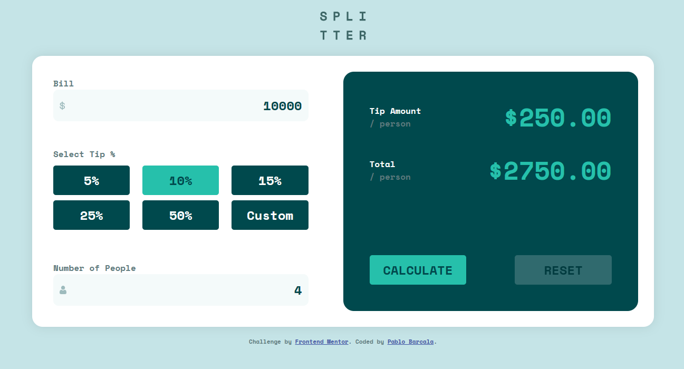

# Frontend Mentor - Tip calculator app solution

<<<<<<< HEAD

=======
>>>>>>> 852ff660d6fe52df7b889de36779b5a35c1d9ffb
This is a solution to the [Tip calculator app challenge on Frontend Mentor](https://www.frontendmentor.io/challenges/tip-calculator-app-ugJNGbJUX). Frontend Mentor challenges help you improve your coding skills by building realistic projects.

## Welcome! 👋

## Table of contents

- [Overview](#overview)
  - [The challenge](#the-challenge)
  - [Screenshot](#screenshot)
  - [Links](#links)
- [My process](#my-process)
  - [Built with](#built-with)
  - [What I learned](#what-i-learned)
- [Author](#author)

## Overview

### The challenge

Users should be able to:

- View the optimal layout for the app depending on their device's screen size
- See hover states for all interactive elements on the page
- Calculate the correct tip and total cost of the bill per person

### Screenshot



### Links

- Solution URL: [GitHub Repository Page](https://github.com/pablobarcala/Tip-Calculator)
- Live Site URL: [Live Site URL](https://pablobarcala.github.io/Tip-Calculator/)

## My process

### Built with

- Semantic HTML5 markup
- CSS custom properties
- Flexbox

### What I learned

I learned how to read different inputs and use them to calculate the tip and total bill. Also, i learned how to read a tip from a group of buttons or from a custom input, if needed.

```js
var tipBtns = document.getElementById("tip")

for(let i = 0; i < tipBtns.length; i++) {
  tipBtns.item(i).addEventListener("click", () => {
    validateBtn(i)
  })
```

## Author

- Website - [Pablo Barcala](https://pablobarcala.com.ar)
- Frontend Mentor - [@pablobarcala](https://www.frontendmentor.io/profile/pablobarcala)
- Linkedin - [Pablo Barcala](https://www.linkedin.com/in/pablo-dami%C3%A1n-barcala-60a1a923a/)
